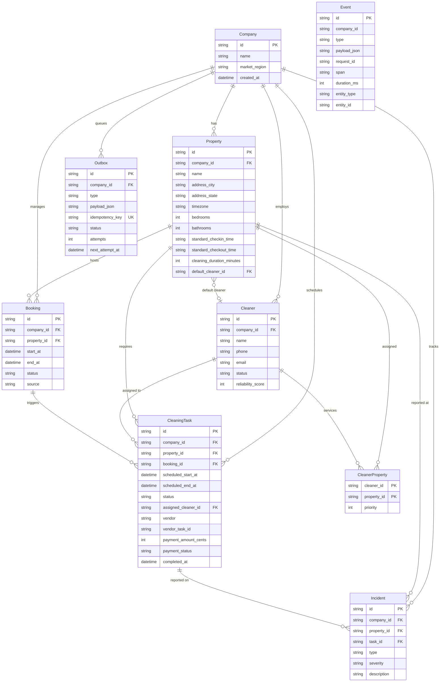
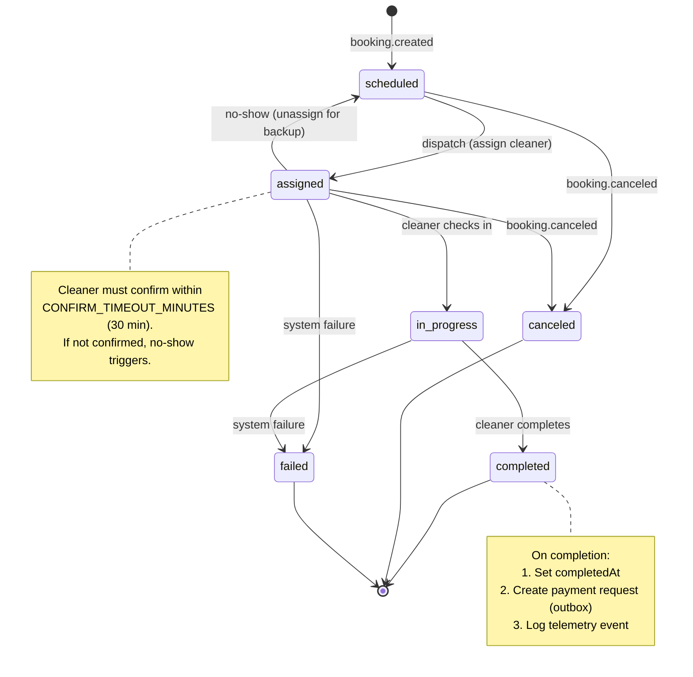
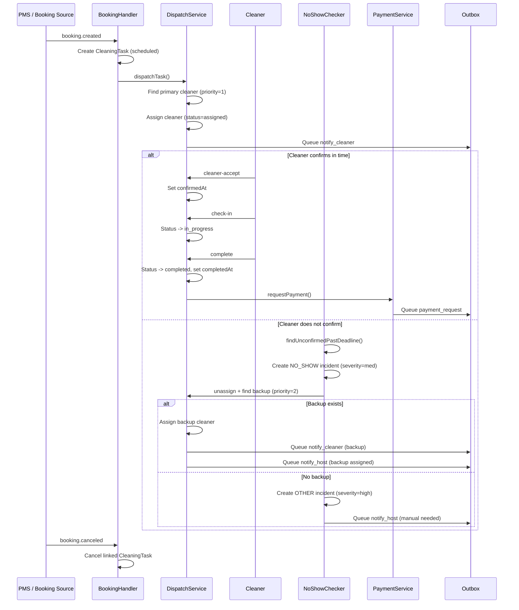
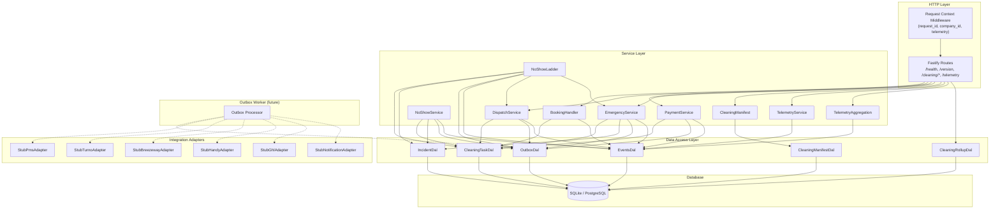
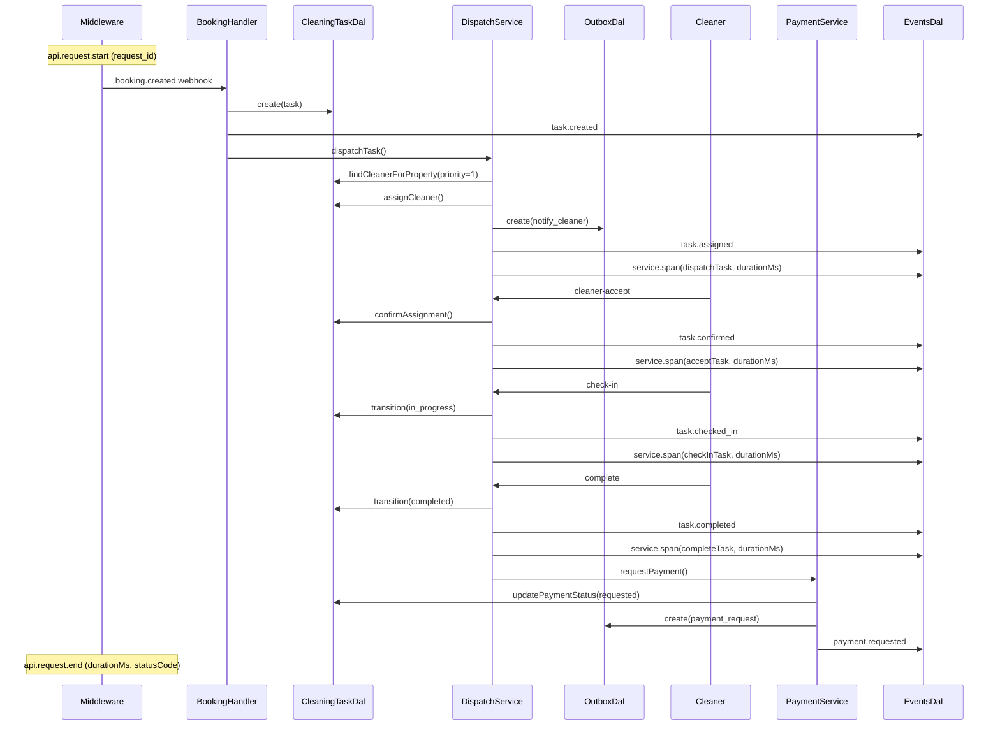
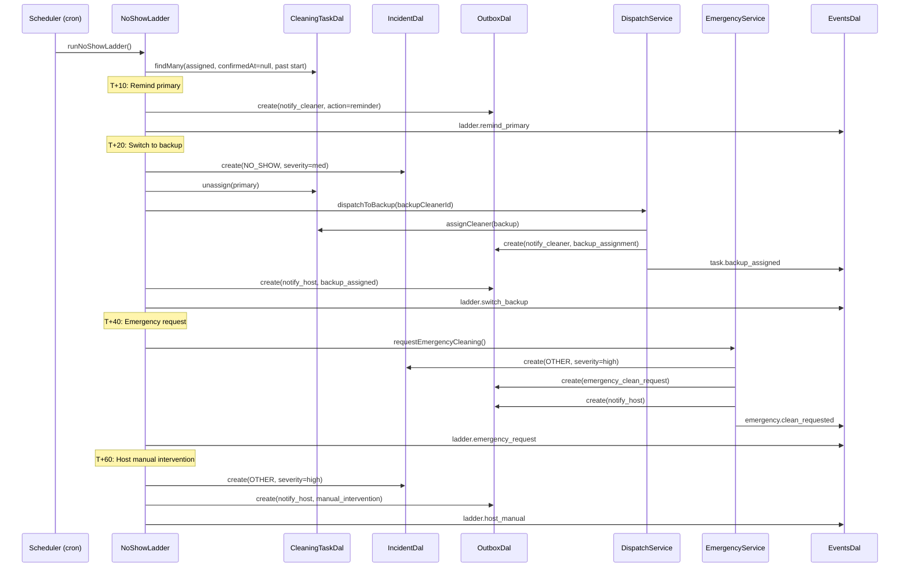

# Architecture

## Layered Architecture

```
HTTP Request
    |
    v
Fastify Route (thin: validate input, call service, send response)
    |
    v
Service Layer (business logic, orchestration)
    |
    v
DAL — Data Access Layer (Prisma queries, always tenant-scoped)
    |
    v
Prisma ORM -> SQLite (dev) / PostgreSQL (prod)
```

## Key Principles

1. **Routes never touch the database directly.** They call services.
2. **Services never import Prisma directly.** They call the DAL.
3. **External vendors are accessed through adapter interfaces** under `src/integrations/`.
4. **All outbound side-effects go through an outbox table** for safe retry.
5. **Multi-tenant isolation**: every query is scoped to `company_id`.

## Data Model (Phase 1)



### Table Summary

| Table | Purpose | Tenant-scoped |
|-------|---------|:---:|
| `companies` | PMC tenant boundary | (root) |
| `properties` | Rental units per PMC | Yes |
| `cleaners` | Cleaning staff per PMC | Yes |
| `cleaner_properties` | Many-to-many cleaner-property mapping with priority | Yes |
| `bookings` | Guest reservations | Yes |
| `cleaning_tasks` | Scheduled/completed cleaning jobs | Yes |
| `incidents` | Issues reported on tasks (NO_SHOW, DAMAGE, etc.) | Yes |
| `outbox` | Transactional outbox for async side-effects | Yes |
| `events` | Telemetry / audit log | Optional |

### Cleaning Task Status Flow (Phase 3)



### Task Lifecycle Workflow (Phase 3)



### API Endpoints (Phase 3)

| Method | Path | Purpose |
|--------|------|---------|
| GET | `/companies/:companyId/cleaning/tasks` | List tasks (filter by date, property, status) |
| GET | `/companies/:companyId/cleaning/rollup` | Cleaning metrics rollup |
| POST | `/companies/:companyId/cleaning/tasks/:taskId/cleaner-accept` | Cleaner confirms assignment |
| POST | `/companies/:companyId/cleaning/tasks/:taskId/check-in` | Cleaner starts cleaning |
| POST | `/companies/:companyId/cleaning/tasks/:taskId/complete` | Cleaner finishes (triggers payment) |

### Configuration (Phase 3)

| Config Key | Default | Description |
|-----------|---------|-------------|
| `CONFIRM_TIMEOUT_MINUTES` | 30 | Minutes before unconfirmed assignment triggers no-show |
| `NO_SHOW_GRACE_MINUTES` | 15 | Extra grace after scheduled start (reserved for future use) |
| `ON_TIME_DEFINITION` | `scheduledEndAt` | Task is "on time" if completedAt <= this field |

### Incident Types

- `NO_SHOW` — Cleaner didn't confirm or arrive
- `LATE_START` — Cleaning started after scheduled time
- `DAMAGE` — Property damage discovered
- `SUPPLIES` — Supply issues (low stock, missing items)
- `ACCESS` — Access problems (lockbox, key)
- `OTHER` — Anything else (includes "manual intervention needed")

## Component Diagram (Phase 5)



## Sequence Diagram: Booking to Payment (Happy Path)



## Sequence Diagram: No-Show to Emergency Escalation



## Telemetry Events (Phase 5)

All events written to the `events` table with structured fields:

| Event Type | When | Key Fields |
|-----------|------|------------|
| `api.request.start` | Request begins | request_id, route, method |
| `api.request.end` | Response sent | request_id, route, statusCode, durationMs |
| `service.span` | Service method completes | span (method name), durationMs, request_id |
| `task.created` | Booking handler creates task | entityType=cleaning_task, entityId |
| `task.assigned` | Primary cleaner dispatched | entityType=cleaning_task, cleanerId |
| `task.backup_assigned` | Backup cleaner dispatched | entityType=cleaning_task, cleanerId |
| `task.confirmed` | Cleaner accepts | entityType=cleaning_task |
| `task.checked_in` | Cleaner starts cleaning | entityType=cleaning_task |
| `task.completed` | Cleaning finished | entityType=cleaning_task, completedAt |
| `task.canceled` | Booking canceled | entityType=cleaning_task, reason |
| `task.rescheduled` | Booking extended | entityType=cleaning_task, oldStartAt, newStartAt |
| `payment.requested` | Payment queued | entityType=cleaning_task |
| `ladder.remind_primary` | T+10 reminder sent | entityType=cleaning_task |
| `ladder.switch_backup` | T+20 backup assigned | entityType=cleaning_task |
| `ladder.emergency_request` | T+40 emergency fired | entityType=cleaning_task |
| `ladder.host_manual` | T+60 manual alert | entityType=cleaning_task |
| `emergency.clean_requested` | Emergency clean created | entityType=cleaning_task |

## TODO (Phase 6+)

- [ ] Add JWT auth middleware (extract company_id from token)
- [ ] Add outbox processor worker (poll + deliver side-effects)
- [ ] Rate limiting and CORS middleware
- [ ] Real vendor adapter implementations (Turno, Breezeway, Handy)
- [ ] Stripe Connect payment processing
- [ ] WebSocket real-time dashboard events
- [ ] OpenTelemetry exporter for production APM
- [ ] Postgres Row-Level Security for multi-tenant isolation
